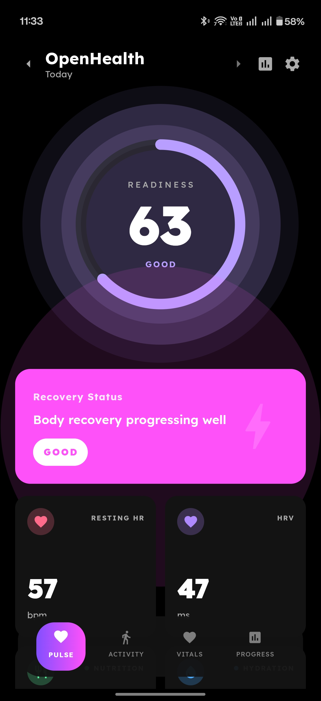
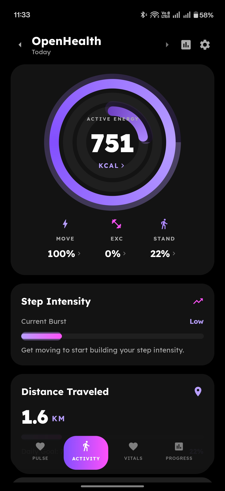
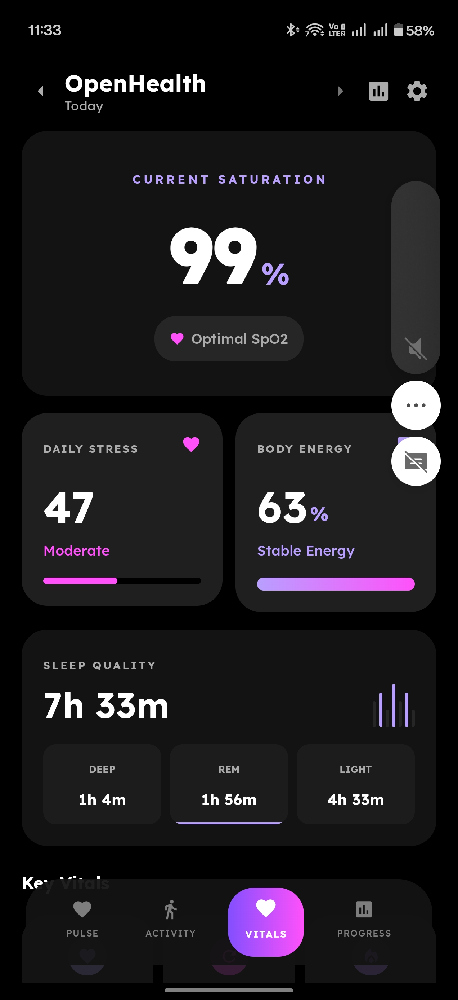
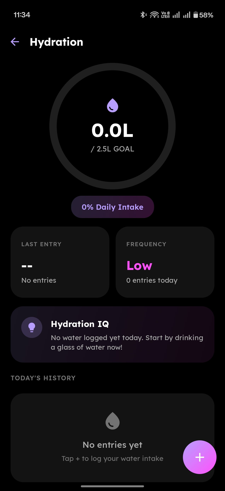
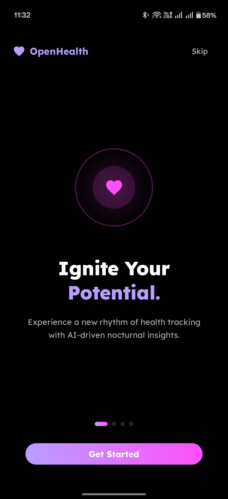
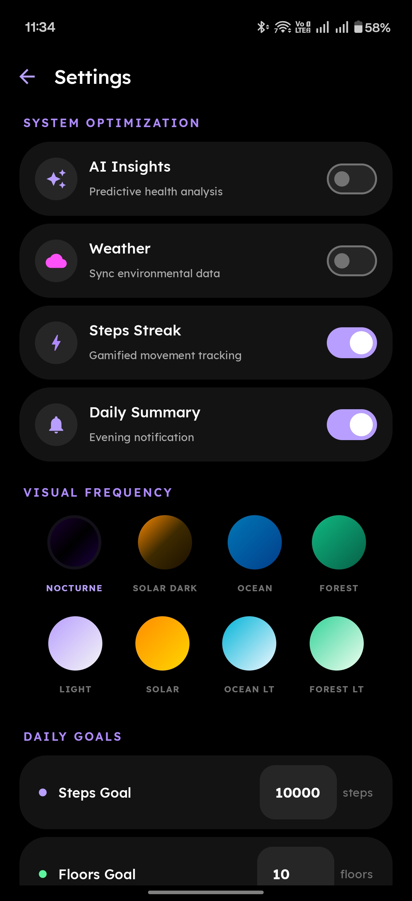
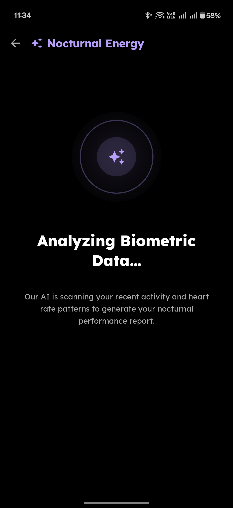

# OpenHealth

<p align="center">
  <b>Premium open-source health dashboard for Android</b><br>
  <i>Electric Nocturne Design System — 8 themes, AI insights, spring animations</i>
</p>

<p align="center">
  
  
  
  
  
</p>

---

## Screenshots

<p align="center">
  
  
  
  
</p>

<p align="center">
  
  
  
</p>

## Features

### Health Metrics
- **Readiness Score** — weighted recovery score (HRV 40%, Sleep 25%, Awake 20%, RHR 10%, Activity 5%)
- **Heart Rate** — current, resting, min/max with gradient chart
- **Heart Rate Variability** — arc gauge, recovery insight, sleep coach
- **Sleep Analysis** — clock ring, stages breakdown, sleep bank, efficiency
- **Blood Oxygen (SpO2)** — hero card with optimal range indicator
- **Respiratory Rate** — stability badge, recovery insight
- **Steps** — hero ring with goal progress, neural insight
- **Calories** — active energy tracking
- **Body Composition** — weight ring gauge, composition matrix, 7-day velocity
- **Nutrition** — daily intake, macro breakdown (protein/carbs/fat)
- **Exercise** — workout analytics, training load, session details
- **Stress & Resilience** — arc gauge, coaching, contributing factors
- **Distance, Floors, VO2 Max, Blood Pressure, Blood Glucose, Body Temperature, Skin Temperature**

### App Features
- **4-Tab Navigation** — Pulse, Activity, Vitals, Progress
- **8 Themes** — Nocturne, Solar Dark, Ocean, Forest (dark) + Light, Solar, Ocean Light, Forest Light
- **AI Health Analysis** — BYOK with Claude, Gemini, ChatGPT, or custom OpenAI-compatible API
- **Hydration Tracking** — add water, daily history, configurable goal
- **Spring Animations** — bounce on tap, spring-loaded rings, smooth transitions
- **Material 3 Expressive** — physics-based motion scheme
- **Performance Screen** — glowing activity rings with intensity flow
- **Workout Detail** — per-session stats, heart rate, AI insight
- **Night Owl Mode** — AI doesn't assume morning schedule
- **Pull to Refresh** — instant data sync from Health Connect
- **Encrypted API Keys** — AES-256 via EncryptedSharedPreferences
- **100% Private** — no accounts, no servers, no tracking

### Security
- API keys encrypted at rest (AES-256-GCM)
- HTTPS enforced (cleartext blocked except localhost)
- Release builds minified and obfuscated (R8)
- Encrypted data excluded from cloud backups
- Read-only Health Connect permissions

## Tech Stack

| Technology | Purpose |
|------------|---------|
| **Kotlin 2.0** | Language |
| **Jetpack Compose** | Declarative UI |
| **Material 3 Expressive** | Theme + spring animations |
| **Health Connect SDK 1.1.0** | Health data access |
| **Lexend Font** | Premium typography (7 weights) |
| **OkHttp** | AI API calls |
| **EncryptedSharedPreferences** | Secure key storage |
| **MVVM + StateFlow** | Architecture |

## Getting Started

### Prerequisites

1. Android 9.0+ device with Health Connect app installed
2. A wearable (Garmin, Amazfit, Samsung, etc.) syncing to Health Connect

### Install

```bash
git clone https://github.com/bune1991/OpenHealth.git
cd OpenHealth
./gradlew installDebug
```

### AI Setup (Optional)

1. Open Settings > AI Insights > toggle ON
2. Select provider (Claude, Gemini, ChatGPT, Custom)
3. Paste your API key
4. Tap "Analyze" on the Pulse tab for personalized health insights

## Architecture

```
┌─────────────────┐     ┌─────────────────┐     ┌─────────────────┐
│   UI Layer      │────>│  ViewModel      │────>│  Health Connect │
│  (Compose)      │<────│  (StateFlow)    │<────│  + SharedPrefs  │
│                 │     │                 │     │  + AI Service   │
│  DashboardScreen│     │  HealthViewModel│     │  HealthConnect  │
│  MetricDetail   │     │  Settings       │     │  Manager        │
│  Performance    │     │  Hydration      │     │  WeatherService │
│  HydrationScreen│     │  Navigation     │     │  AiHealthService│
└─────────────────┘     └─────────────────┘     └─────────────────┘
```

## Contributing

Contributions welcome! Please open an issue first for major changes.

1. Fork the repo
2. Create your branch (`git checkout -b feature/YourFeature`)
3. Commit (`git commit -m 'Add YourFeature'`)
4. Push (`git push origin feature/YourFeature`)
5. Open a Pull Request

## License

**GNU General Public License v3.0 (GPL-3.0)**

```
OpenHealth - Premium open-source health dashboard for Android
Copyright (C) 2024-2026 Fahad (bune1991)

This program is free software: you can redistribute it and/or modify
it under the terms of the GNU General Public License as published by
the Free Software Foundation, either version 3 of the License, or
(at your option) any later version.
```

## Author

**Fahad (bune1991)** — [@bune1991](https://github.com/bune1991)

## Acknowledgments

- [Health Connect](https://developer.android.com/health-connect) by Google
- [Material Design 3 Expressive](https://m3.material.io/) by Google
- [Lexend Font](https://fonts.google.com/specimen/Lexend) by Bonnie Shaver-Troup
- [Google Stitch](https://stitch.withgoogle.com/) for UI design generation
- [Claude](https://claude.ai/) by Anthropic for AI-assisted development

---

<p align="center">
  Made with care for health-conscious Android users
</p>
