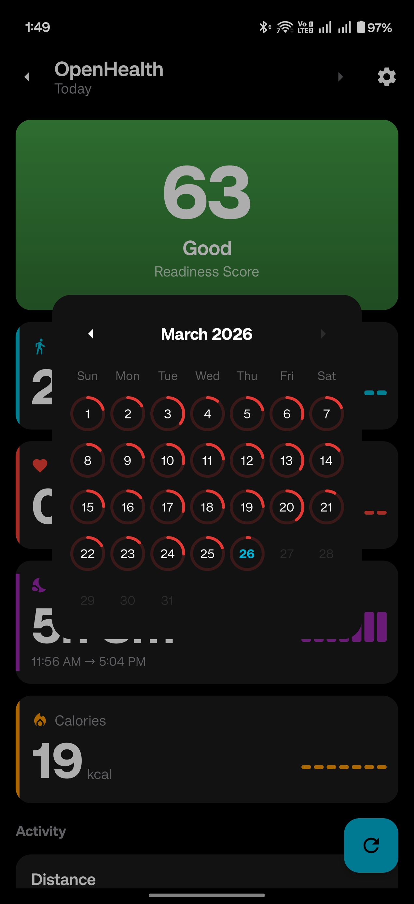

# OpenHealth

<p align="center">
  
</p>

<p align="center">
  <b>A beautiful Android health dashboard that reads from Health Connect</b>
</p>

<p align="center">
  
  
  
  
</p>

---

## 📱 Overview

OpenHealth is a modern, privacy-focused health dashboard for Android that seamlessly integrates with **Health Connect** to provide you with a beautiful overview of your health and fitness data. Inspired by the clean design of Garmin Connect, OpenHealth puts your health metrics front and center with an intuitive dark-themed interface.

## ✨ Features

### Health Metrics Supported

- **Activity Tracking**
  - Steps count with daily goals
  - Distance traveled (km/miles)
  - Floors climbed
  - Active calories burned
  - Total calories burned

- **Heart & Cardio**
  - Current heart rate
  - Resting heart rate
  - Heart rate variability (HRV)
  - VO2 Max
  - Blood pressure
  - Oxygen saturation (SpO2)
  - Respiratory rate

- **Sleep Analysis**
  - Total sleep duration
  - Sleep stages breakdown (Deep, Light, REM, Awake)
  - Sleep quality insights

- **Body Composition**
  - Weight tracking
  - Body fat percentage
  - Body water mass
  - Bone mass
  - Lean body mass
  - Basal Metabolic Rate (BMR)

- **Exercise & Workouts**
  - Exercise sessions
  - Workout duration and intensity
  - Speed and power metrics

- **Additional Vitals**
  - Blood glucose levels
  - Body temperature
  - Hydration tracking
  - Nutrition data
  - Mindfulness sessions

### App Features

- 🎨 **Beautiful Dark Theme** - Easy on the eyes with Material 3 design
- 📊 **Detailed History** - View trends and statistics for all metrics
- 📅 **Date Navigation** - Browse through previous days' data
- ⚡ **Fast Performance** - Optimized with caching and coroutines
- 🔒 **Privacy First** - Your data stays on your device
- 🎯 **Customizable** - Settings to personalize your experience
- 📱 **Modern UI** - Smooth animations and skeleton loading screens

## 📋 Requirements

- **Android Version**: Android 8.0 (API 26) or higher
- **Health Connect**: Health Connect app must be installed and set up
- **Permissions**: Health data read permissions required

## 🛠️ Tech Stack

| Technology | Purpose |
|------------|---------|
| **Kotlin** | Primary programming language |
| **Jetpack Compose** | Modern declarative UI toolkit |
| **Material 3** | Latest Material Design components |
| **Health Connect SDK** | Access to health and fitness data |
| **MVVM Architecture** | Clean separation of concerns |
| **Kotlin Coroutines** | Asynchronous operations |
| **StateFlow** | Reactive state management |

## 🚀 Getting Started

### Prerequisites

1. Install [Android Studio](https://developer.android.com/studio) (latest version recommended)
2. Ensure you have Android SDK 26 or higher
3. Have the Health Connect app installed on your test device

### Installation

1. Clone the repository:
   ```bash
   git clone https://github.com/bune1991/OpenHealth.git
   ```

2. Open the project in Android Studio

3. Sync Gradle files and build the project:
   ```bash
   ./gradlew build
   ```

4. Run on your device or emulator:
   ```bash
   ./gradlew installDebug
   ```

### Setting Up Health Connect

1. Install the [Health Connect app](https://play.google.com/store/apps/details?id=com.google.android.apps.healthdata) from the Play Store
2. Open Health Connect and grant permissions to your health data sources
3. Launch OpenHealth and grant the requested permissions
4. Your health data will automatically sync to the dashboard

## 📸 Screenshots

<p align="center">
  
</p>

<p align="center">
  <i>More screenshots coming soon...</i>
</p>

## 🏗️ Architecture

OpenHealth follows the **MVVM (Model-View-ViewModel)** architecture pattern:

```
┌─────────────────┐     ┌─────────────────┐     ┌─────────────────┐
│   UI Layer      │────▶│  ViewModel      │────▶│   Repository    │
│  (Compose)      │◀────│  (StateFlow)    │◀────│  (Health Connect)│
└─────────────────┘     └─────────────────┘     └─────────────────┘
```

### Key Components

- **DashboardScreen** - Main dashboard with metric cards
- **MetricDetailScreen** - Detailed view with history and charts
- **HealthViewModel** - Business logic and state management
- **HealthConnectManager** - Health Connect SDK wrapper
- **SettingsManager** - User preferences and configuration

## 🤝 Contributing

Contributions are welcome! Please feel free to submit a Pull Request. For major changes, please open an issue first to discuss what you would like to change.

1. Fork the repository
2. Create your feature branch (`git checkout -b feature/AmazingFeature`)
3. Commit your changes (`git commit -m 'Add some AmazingFeature'`)
4. Push to the branch (`git push origin feature/AmazingFeature`)
5. Open a Pull Request

## 📝 License

This project is licensed under the **GNU General Public License v3.0 (GPL-3.0)** - see the [LICENSE](LICENSE) file for details.

```
OpenHealth - A beautiful Android health dashboard
Copyright (C) 2024  Fahad (bune1991)

This program is free software: you can redistribute it and/or modify
it under the terms of the GNU General Public License as published by
the Free Software Foundation, either version 3 of the License, or
(at your option) any later version.
```

## 👤 Author

**Fahad (bune1991)**

- GitHub: [@bune1991](https://github.com/bune1991)

## 🙏 Acknowledgments

- [Health Connect](https://developer.android.com/health-connect) by Google
- [Jetpack Compose](https://developer.android.com/jetpack/compose) team
- [Material Design 3](https://m3.material.io/) guidelines
- Garmin Connect for design inspiration

## 📧 Contact

For questions, suggestions, or feedback, please open an issue on GitHub.

---

<p align="center">
  Made with ❤️ for health-conscious Android users
</p>
